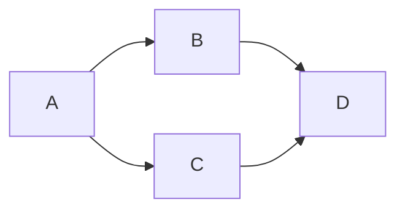
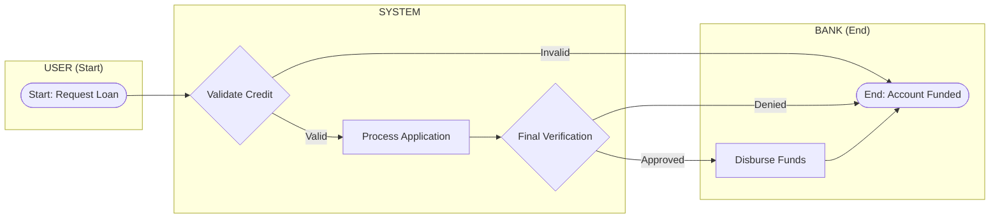

# TITLE

```mermaid
graph LR;
    A-->B;
    A-->C;
    B-->D;
    C-->D;
```

```mermaid

flowchart LR

    
    %% Subgraph for USER Pool
    subgraph USER ["USER (Start)"]
        A([Start: Request Loan])
    end
    

    %% Subgraph for SYSTEM Pool
    subgraph SYSTEM ["SYSTEM"]
        B{Validate Credit}
        C[Process Application]
        D{Final Verification}
    end

    %% Subgraph for BANK Pool
    subgraph BANK ["BANK (End)"]
        E[Disburse Funds]
        F([End: Account Funded])
    end

    %% Connections and Logic
    A --> B
    B -- Valid --> C
    B -- Invalid --> F
    C --> D
    D -- Approved --> E
    D -- Denied --> F
    E --> F
```
    